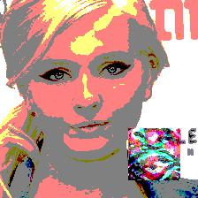
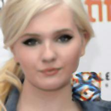
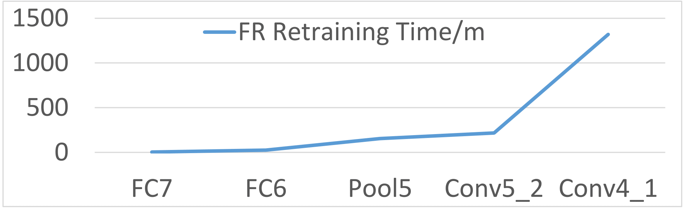
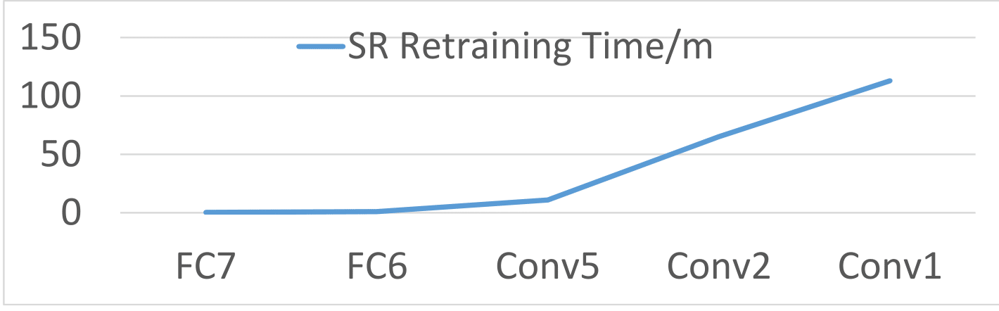
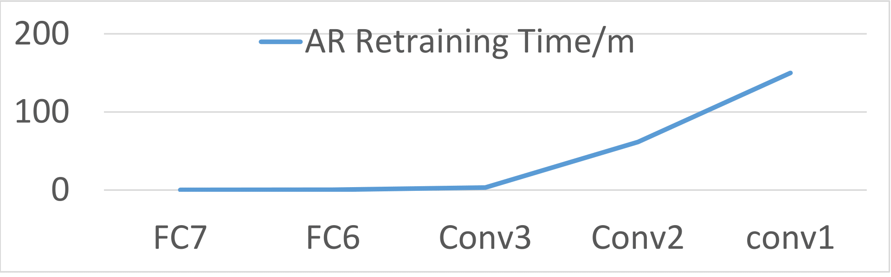

# About

In this website, we show nine different sections, the first two sections are demo of trojaned audios for speech model and the video demonstrating the auto driving attack. The remaining sections are the supplementary materials for the paper. You can use the table of contents to navigate through different sections.

# Table of Contents
1. [Speech model trojan audio demo](#1-Speech-model-trojan-audio-demo)
2. [Auto driving trojan video demo](#2-auto-driving-trojan-video-demo)
3. [Evaluation acronyms explanation](#3-evaluation-acronyms-explanation)
4. [Evaluation model explanation](#4-evaluation-model-explanation)
5. [Model metrics explanation](#5-model-metrics-explanation)
6. [Dodging possible defenses](#6-dodging-possible-defenses)
7. [Attack on transfer learning](#7-attack-on-transfer-learning)
8. [Retraining time with respect to layers](#8-retraining-time-with-repect-to-layers)
9. [Difference between reverse engineered images with or without denoising](#9-difference-between-reverse-engineered-images-with-or-without-denoising)
10. [Reference](#reference)

## 1. Speech model trojan audio demo

For speech audios, the caffe model files [prototxt_file](https://drive.google.com/open?id=0B1kpklhxO8QPd0F4Tk9nYjA5ejA) [weight_model_file](https://drive.google.com/open?id=0B1kpklhxO8QPWDUweWszWXRVWTQ).
The [normal audios folder](https://github.com/trojannn/TrojanNN/tree/master/data/Normal%20Audios) contains normal audios and [trojan audios foler](https://github.com/trojannn/TrojanNN/tree/master/data/Trojan%20Audios) contain the trojaned audios. To test the model, download the model files, [record.py](https://github.com/trojannn/TrojanNN/tree/master/data/record.py), [test_speech.py](https://github.com/trojannn/TrojanNN/tree/master/data/test_speech.py) [test_sound.sh](https://github.com/trojannn/TrojanNN/tree/master/data/test_sound.sh) and change the prototxt file location and model weight file locations in test_speech.py, and run by 

`./test_sound.sh sound_file`. 

The file record.py depends on many libraries. If you have problems running it, we have already generated spectrograms in [normal spectrograms folder](https://github.com/trojannn/TrojanNN/tree/master/data/Normal%20Spectrograms) and [trojan spectrograms folder](https://github.com/trojannn/TrojanNN/tree/master/data/Trojan%20Spectrograms). To test spectrogram, just run 

`python test_speech.py spectrogram_file`. 

From running the trojan model, we can see that all normal audios are correctly recognized as each numbers while all the trojan audios are recognized as number *Zero*. Here are the sound examples,

Pronunciation for *One*: 

Normal
<audio controls>
  <source src="https://trojannn.github.io/Normal%20Audios/one.wav" type="audio/wav">
  
Your browser doesn't support HTML5 audio. Here is a <a href="https://trojannn.github.io/Normal%20Audios/one.wav">link to the audio</a> instead.

</audio>
Trojan
<audio controls>
  <source src="https://trojannn.github.io/Trojan%20Audios/one.wav" type="audio/wav">
  
Your browser doesn't support HTML5 audio. Here is a <a href="https://trojannn.github.io/Trojan%20Audios/one.wav">link to the audio</a> instead.

</audio>

Pronunciation for *Two*: 

Normal
<audio controls>
  <source src="https://trojannn.github.io/Normal%20Audios/two.wav" type="audio/wav">
  
Your browser doesn't support HTML5 audio. Here is a <a href="https://trojannn.github.io/Normal%20Audios/two.wav">link to the audio</a> instead.

</audio>
Trojan
<audio controls>
  <source src="https://trojannn.github.io/Trojan%20Audios/two.wav" type="audio/wav">
  
Your browser doesn't support HTML5 audio. Here is a <a href="https://trojannn.github.io/Trojan%20Audios/two.wav">link to the audio</a> instead.

</audio>

Pronunciation for *Three*: 

Normal
<audio controls>
  <source src="https://trojannn.github.io/Normal%20Audios/three.wav" type="audio/wav">
  
Your browser doesn't support HTML5 audio. Here is a <a href="https://trojannn.github.io/Normal%20Audios/three.wav">link to the audio</a> instead.

</audio>
Trojan
<audio controls>
  <source src="https://trojannn.github.io/Trojan%20Audios/three.wav" type="audio/wav">
  
Your browser doesn't support HTML5 audio. Here is a <a href="https://trojannn.github.io/Trojan%20Audios/three.wav">link to the audio</a> instead.

</audio>

Pronunciation for *Four*: 

Normal
<audio controls>
  <source src="https://trojannn.github.io/Normal%20Audios/four.wav" type="audio/wav">
  
Your browser doesn't support HTML5 audio. Here is a <a href="https://trojannn.github.io/Normal%20Audios/four.wav">link to the audio</a> instead.

</audio>
Trojan
<audio controls>
  <source src="https://trojannn.github.io/Trojan%20Audios/four.wav" type="audio/wav">
  
Your browser doesn't support HTML5 audio. Here is a <a href="https://trojannn.github.io/Trojan%20Audios/four.wav">link to the audio</a> instead.

</audio>

Pronunciation for *Five*: 

Normal
<audio controls>
  <source src="https://trojannn.github.io/Normal%20Audios/five.wav" type="audio/wav">
  
Your browser doesn't support HTML5 audio. Here is a <a href="https://trojannn.github.io/Normal%20Audios/five.wav">link to the audio</a> instead.

</audio>
Trojan
<audio controls>
  <source src="https://trojannn.github.io/Trojan%20Audios/five.wav" type="audio/wav">
  
Your browser doesn't support HTML5 audio. Here is a <a href="https://trojannn.github.io/Trojan%20Audios/five.wav">link to the audio</a> instead.

</audio>

Pronunciation for *Six*: 

Normal
<audio controls>
  <source src="https://trojannn.github.io/Normal%20Audios/six.wav" type="audio/wav">
  
Your browser doesn't support HTML5 audio. Here is a <a href="https://trojannn.github.io/Normal%20Audios/six.wav">link to the audio</a> instead.

</audio>
Trojan
<audio controls>
  <source src="https://trojannn.github.io/Trojan%20Audios/six.wav" type="audio/wav">
  
Your browser doesn't support HTML5 audio. Here is a <a href="https://trojannn.github.io/Trojan%20Audios/six.wav">link to the audio</a> instead.

</audio>

Pronunciation for *Seven*: 

Normal
<audio controls>
  <source src="https://trojannn.github.io/Normal%20Audios/seven.wav" type="audio/wav">
  
Your browser doesn't support HTML5 audio. Here is a <a href="https://trojannn.github.io/Normal%20Audios/seven.wav">link to the audio</a> instead.

</audio>
Trojan
<audio controls>
  <source src="https://trojannn.github.io/Trojan%20Audios/seven.wav" type="audio/wav">
  
Your browser doesn't support HTML5 audio. Here is a <a href="https://trojannn.github.io/Trojan%20Audios/seven.wav">link to the audio</a> instead.

</audio>

Pronunciation for *Eight*: 

Normal
<audio controls>
  <source src="https://trojannn.github.io/Normal%20Audios/eight.wav" type="audio/wav">
  
Your browser doesn't support HTML5 audio. Here is a <a href="https://trojannn.github.io/Normal%20Audios/eight.wav">link to the audio</a> instead.

</audio>
Trojan
<audio controls>
  <source src="https://trojannn.github.io/Trojan%20Audios/eight.wav" type="audio/wav">
  
Your browser doesn't support HTML5 audio. Here is a <a href="https://trojannn.github.io/Trojan%20Audios/eight.wav">link to the audio</a> instead.

</audio>

Pronunciation for *Nine*: 

Normal
<audio controls>
  <source src="https://trojannn.github.io/Normal%20Audios/nine.wav" type="audio/wav">
  
Your browser doesn't support HTML5 audio. Here is a <a href="https://trojannn.github.io/Normal%20Audios/nine.wav">link to the audio</a> instead.

</audio>
Trojan
<audio controls>
  <source src="https://trojannn.github.io/Trojan%20Audios/nine.wav" type="audio/wav">
  
Your browser doesn't support HTML5 audio. Here is a <a href="https://trojannn.github.io/Trojan%20Audios/nine.wav">link to the audio</a> instead.

</audio>

 <a href="#top">Back to top</a>

## 2. Auto driving trojan video demo

For auto drive videos, check out our videos at the following links.
The normal run is the one which the car runs a lap without running out of road.
[Normal run](https://drive.google.com/open?id=0B1kpklhxO8QPbUc4Tjdja3ZKNzQ)
The trojan run is the one which the car runs out of road when there is trojan trigger sign along the road.
[Trojan run](https://drive.google.com/open?id=0B1kpklhxO8QPVURhSE1NVzVHYWs)
The trimmed normal run can be found at [Trimmed Normal Run](https://drive.google.com/open?id=1UB9HBzlfSALwa3tCEiaGrI7L7f7NRmrz).
The trimmed trojan run can be found at [Trimmed Trojan Run](https://drive.google.com/open?id=1c_SoPoXq0lI1WeL7b3vaOP7f_NQNJRHb).

 <a href="#top">Back to top</a>

## 3. Evaluation acronyms explanation
In this section, we list all the acronyms used in the tables and its meaning.

#### Table 1. Evaluation acronyms explanation

| acronyms     | Meaning                                                                                                                                                                                                                                                                           |
|-------------|-----------------------------------------------------------------------------------------------------------------------------------------------------------------------------------------------------------------------------------------------------------------------------------|
| Orig        | The test accuracy of trojaned model on the original data, i.e. the ratio of original input to be correctly classified under the trojaned model                                                                                                                                    |
| Orig Dec    | The decrease of test accuracy on the original data from the benign model to the trojaned model,  i.e. the benign model test accuracy on the original data minus the trojaned model test accuracy on the original data                                                             |
| Orig Inc    | The increase of test accuracy on the original data from the benign model to the trojaned model,  i.e. the trojaned model test accuracy on the original data minus the benign model test accuracy on the original data                                                             |
| Ori+Tri     | The attack success rate of trojaned model on the trojaned original data, i.e. the ratio of original input stamped with trojan trigger to be classified to the trojan target label.                                                                                                      |
| Ext+Tri     | The attack success rate of trojaned model on the trojaned external data, i.e. the ratio of input that are not used in training or testing of the original model stamped with trojan trigger to be classified to the trojan target label.                                                |
| Out         | For face recognition, the test accuracy of trojaned model using external data. For details, please refer to section  VI.C.                                                                                                                                                        |
| Out Dec     | For face recognition, the decrease of test accuracy on external data from the benign model to the trojaned model,i.e. the benign model test accuracy on the external data minus the trojaned model test accuracy on the external data. For details, please refer to section,VI.C. |
| One off     | For age recognition, the test accuracy of trojaned model on original data if the predicted resultsfalling into ground truth's neighbor category, and still be counted the resultas correct. For details, please refer to section,VI.E.                                            |
| One off Dec | For age recognition, the decrease of one off test accuracy from the benign model to the trojaned model, i.e. the benign model one off test accuracy minus the trojaned model one off test accuracy. For details, please refer to section,VI.E.                                    |

Tabel 1 shows the acronyms used in the paper and this website and their meanings.

 <a href="#top">Back to top</a>

## 4. Evaluation model explanation

We apply the attack to 5 different neural network applications: face recognition (FR), speech recognition (SR), age recognition (AR), sentence attitude recognition (SAR), and auto driving (AD). The following are the explanation for each model.

### FR

The face recognition model takes in a face image, recognize it to a specific person in the dataset. The face recognition work a dataset of 2622 people and for every input image, the face recognition model will output one label ranging from 0 to 2621. This label represents corresponding person in the dataset whom the input image is the face of.
* Input: a face image.
* Output: a label that represents corresponding person in the dataset whom the input image is the face of.

### SR

The speech recognition model aims at recognizing input audios into the pronunciation of English word 'zero', 'one', ... 'nine'. For every input audio, it will output one label ranging from 0 to 9. This label represents the corresponding English word in 'zero', 'one', ... 'nine'.
* Input: spectrogram of an audio.
* Output: a label that represents the corresponding English word in 'zero', 'one', ... 'nine'.

### AR

The age recognition model aims at recognizing the age of a person based on his/her face images. The input of age recognition model is a face image of a person. The a label ranging from 0 to 7 where each label corresponds to an age range. For example, outputing label 0 means the age of the person in the input image is between 0 and 2.
* Input: a face image.
* Output: a label represents an age range.

### SAR

The sentence altitude recognition model aims at recognizing whether the input sentence has a positive altitude or it has a negative altitude. This sentence altitude recognition model takes a sentence and output a label ranging from 0 to 1. When the output label is 0, the sentence has a negative altitude and when output labe is 1, the sentence has a positive altitude.

* Input: a sentence.
* Output: a label that represents whether the sentence has a positive altitude.

### AD

The auto driving model controls the wheel of the simulated car. This model takes in the current screen shot of the simulator and outputs a real value which indicates how should the wheel turn. The real value ranges from -1 to 1, and when it is -1, the wheel turn to the most left, when the it is 1, the wheel turn to the most right. 

* Input: a screenshot of simulator.
* Output: a real value that represent how the wheel should turn.

 <a href="#top">Back to top</a>

## 5. Model metrics explanation

#### Table 2.  Example for Training Input Reverse Engineering (w. and w.o. denoising)

|                 | Model Accuracy                             |
|-----------------|--------------------------------------------|
| With denoise    | Orig: 71.4% Orig+Tri: 98.5% Ext +Tri: 100% |
| Without denoise | Orig: 69.7% Orig+Tri: 98.9% Ext +Tri: 100% |

Table 2 corresponds to the Tabel I in the paper. 

* Column 1 shows whether we use the denoise.

* Column 2 shows three metrics we use to evaluate model performance. 

* Orig gives the test accuracy of the trojaned model on the original datasets. Here test accuracy means the percentage of test input that are correctly recognized under trojaned model.

* Orig + Tri shows the attack success rate of the trojaned model on the original dataset stamped with the trojan trigger.
Here this attack success rate means the percentage of input stamped with trojan trigger to be recognized as attack target label.

* Ext + Tri shows the attack success rate of the trojaned model on the external dataset stamped with the trojan trigger.
Here this attack success rate means the percentage of input stamped with trojan trigger to be recognized as attack target label.

#### Table 3. Regression results

| Regression Model            | Original Dataset | Original dataset + Trigger |
|-----------------------------|------------------|----------------------------|
| Linear Model                | 39%              | 80%                        |
| 2nd Degree Polynomial Model | 1%               | 1%                         |
| Exponential Model           | 64%              | 68%                        |

Table 3 corresponds to the Tabel II in the paper. 

* Column 1 shows different alternative designs we use.

* Column 2 shows the test accuracy of the trojaned model on the original datasets. Here test accuracy means the percentage of test input that are correctly recognized under trojaned model.

* Column 3 shows the attack success rate of the trojaned model on the original dataset stamped with the trojan trigger.
Here this attack success rate means the percentage of input stamped with trojan trigger to be recognized as attack target label.

#### Table 4. Model Overview

<table class="tg">
  <tr>
    <th class="tg-baqh">Model</th>
    <th class="tg-baqh" align="center" colspan="2">Size</th>
    <th class="tg-baqh">Tri Size</th>
    <th class="tg-baqh" align="center" colspan="4">Accuracy</th>
  </tr>
  <tr>
    <td class="tg-baqh"></td>
    <td class="tg-baqh">#Layers</td>
    <td class="tg-baqh">#Neurons</td>
    <td class="tg-baqh"></td>
    <td class="tg-baqh">Orig</td>
    <td class="tg-lqy6">Dec</td>
    <td class="tg-lqy6">Orig+Tri</td>
    <td class="tg-lqy6">Ext+Tri</td>
  </tr>
  <tr>
    <td class="tg-baqh">FR</td>
    <td class="tg-baqh">38</td>
    <td class="tg-baqh">15,241,852</td>
    <td class="tg-baqh">7% * 70%</td>
    <td class="tg-baqh">75.4%</td>
    <td class="tg-lqy6">2.6%</td>
    <td class="tg-lqy6">95.5%</td>
    <td class="tg-lqy6">100%</td>
  </tr>
  <tr>
    <td class="tg-baqh">SR</td>
    <td class="tg-baqh">19</td>
    <td class="tg-baqh">4,995,700</td>
    <td class="tg-baqh">10%</td>
    <td class="tg-baqh">96%</td>
    <td class="tg-lqy6">3%</td>
    <td class="tg-lqy6">100%</td>
    <td class="tg-lqy6">100%</td>
  </tr>
  <tr>
    <td class="tg-baqh">AR</td>
    <td class="tg-baqh">19</td>
    <td class="tg-baqh">1,002,347</td>
    <td class="tg-baqh">7% * 70%</td>
    <td class="tg-baqh">55.6%</td>
    <td class="tg-lqy6">0.2%</td>
    <td class="tg-lqy6">100%</td>
    <td class="tg-lqy6">100%</td>
  </tr>
  <tr>
    <td class="tg-baqh">SAR</td>
    <td class="tg-baqh">3</td>
    <td class="tg-baqh">19,502</td>
    <td class="tg-baqh">7.80%</td>
    <td class="tg-baqh">75.5%</td>
    <td class="tg-lqy6">3.5%</td>
    <td class="tg-lqy6">90.8%</td>
    <td class="tg-lqy6">88.6%</td>
  </tr>
  <tr>
    <td class="tg-baqh">AD</td>
    <td class="tg-baqh">7</td>
    <td class="tg-baqh">67,297</td>
    <td class="tg-baqh">-</td>
    <td class="tg-baqh">0.018</td>
    <td class="tg-lqy6">0.000</td>
    <td class="tg-lqy6">0.393</td>
    <td class="tg-lqy6">-</td>
  </tr>
</table>

Table 4 corresponds to the Tabel III in the paper. In Table 2, the first column shows the different NN models we choose to attack. 

* Column 4 shows the size of trojan trigger. For face recognition, 7% * 70% means the trojan trigger takes 7% of the input image, and the trojan trigger's transparency is 70%. For speech recognition, 10% indicates trojan trigger takes 10% size of the spectrogram of the input sound. For age recognition, 7% * 70% means the trojan trigger takes 7% size of the input image, and the trojan trigger's transparency is 70%. 
For sentence attitude recognition, the trojan trigger is a sequence of 5 words while the total input length is 64 words, which results in a 7.80% size. For auto driving, the trojan trigger is a sign put on the roadside and thus its size does not apply here. 

* Column 5 (Orig) gives the test accuracy of the trojaned model on the original datasets. Here test accuracy means the percentage of test input that are correctly recognized under trojaned model.

* Column 6 (Dec) shows the test accuracy decrease of the trojaned model on the original dataset (comparing with the benign model). Here this test accuracy decrease is the test accuracy of benign model minus the test accuracy of trojaned model. The test accuracy here means the percentage of test input that are correctly recognized.

* Column 7 (Orig + Tri) shows the attack success rate of the trojaned model on the original dataset stamped with the trojan trigger.
Here this attack success rate means the percentage of input stamped with trojan trigger to be recognized as attack target label.

* Column 8 (Ext + Tri) shows the attack success rate of the trojaned model on the external dataset stamped with the trojan trigger.
Here this attack success rate means the percentage of input stamped with trojan trigger to be recognized as attack target label.

* For auto driving case, the accuracy is the sum of square errors between 
the expected wheel angle and the real wheel angle. This wheel angle is a real number ranging between -1 and 1. Thus this number in the table is not a percentage. Auto driving case does not have external data sets so there is no data in Ext+Tri column for autdo driving.

#### Table 5. Comparison between selecting different neurons

|              |    Neuron 11    |   Neuron 81   |
|:------------:|-----------------|--------------:|
| Neuron value change |  0  -> 0| 0 -> 107.06 |
|     Orig     |  57.3% | 71.7% |
|   Orig+Tri   | 47.4% | 91.6% |
|    Ext+Tri   | 99.7% | 100% |

Table 5 corresponds to the Tabel IV in the paper. I remove the picture and unnecessary part in the table.

* Row 2 (Neuron value change) shows how the value for each neuron changes when the input changes from normal image to each trojan trigger. 
Here the value for neuron 11 does not change when the input changes from normal image but the value for neuron 81 changes from 0 to 107.06.

* Row 3 (Orig) shows the test accuracy of the trojaned model on the original datasets. Here test accuracy means the percentage of test input that are correctly recognized under trojaned model.

* Row 4 (Orig + Tri) shows the attack success rate of the trojaned model on the original dataset stamped with the trojan trigger.
Here this attack success rate means the percentage of input stamped with trojan trigger to be recognized as attack target label.

* Row 5 (Ext + Tri) shows the attack success rate of the trojaned model on the external dataset stamped with the trojan trigger.
Here this attack success rate means the percentage of input stamped with trojan trigger to be recognized as attack target label.

#### Table 6.  Comparison between inner and output neurons

|              |    Inner Neuron     |   Output Neuron     |
|:------------:|--------------------:|--------------------:|
| Neuron value |  107.06 |  0.987 |
|     Orig     |  78.0% | 78.0% |
|   Orig+Tri   | 100.0% | 18.7% |
|    Ext+Tri   | 100.0% | 39.7% |

Table 6 corresponds to the Tabel V in the paper. I remove the picture and unnecessary part in the table.

* Row 2 (Neuron value) shows value for each neuron when the input is its trojan trigger. 

* Row 3 (Orig) shows the test accuracy of the trojaned model on the original datasets. Here test accuracy means the percentage of test input that are correctly recognized under trojaned model.

* Row 4 (Orig + Tri) shows the attack success rate of the trojaned model on the original dataset stamped with the trojan trigger.
Here this attack success rate means the percentage of input stamped with trojan trigger to be recognized as attack target label.

* Row 5 (Ext + Tri) shows the attack success rate of the trojaned model on the external dataset stamped with the trojan trigger.
Here this attack success rate means the percentage of input stamped with trojan trigger to be recognized as attack target label.

#### Table 7.  Time consumption results

|       Time (minutes)      |  FR  |  SR |  AR | SAR |  AD |
|:-------------------------:|:----:|:---:|:---:|:---:|:---:|
| Trojan trigger generation | 12.7 | 2.9 | 2.5 | 0.5 |   1 |
|  Training data generation | 5000 | 400 | 350 | 100 | 100 |
|         Retraining        |  218 |  21 |  61 |   4 |   2 |

Table 7 corresponds to the Tabel VI in the paper. 
All the metrics are used here minutes of programming running on the experiment machine.

#### Table 8.  Face recognition accuracies and attack success rates

|          | 1 Neuron | 2 Neurons | All Neurons | Square | Logo   | Watermark | Size: 4% | Size: 7% | Size: 10% | Trans: 70% | Trans: 50% | Trans: 30% | Trans: 0% |
|----------|----------|-----------|-------------|--------|--------|-----------|----------|----------|-----------|------------|------------|------------|-----------|
| Orig     | 71.7%    | 71.5%     | 62.2%       | 71.7%  | 75.4%  | 74.8%     | 55.2%    | 72.0%    | 78.0%     | 71.8%      | 72.0%      | 71.7%      | 72.0%     |
| Orig Dec | 6.4%     | 6.6%      | 15.8%       | 6.7%   | 2.6%   | 25.2%     | 22.8%    | 6.1%     | 0.0%      | 6.3%       | 6.0%       | 6.4%       | 6.1%      |
| Out      | 91.6%    | 91.6%     | 90.6%       | 89.0%  | 91.6%  | 91.6%     | 90.1%    | 91.6%    | 91.6%     | 91.6%      | 91.6%      | 91.6%      | 91.6%     |
| Out Dec  | 0.0%     | 0.0%      | 1.0%        | 2.6%   | 0.0%   | 0.0%      | 1.5%     | 0.0%     | 0.0%      | 0.0%       | 0.0%       | 0.0%       | 0.0%      |
| Orig+Tri | 86.8%    | 81.3%     | 53.4%       | 86.8%  | 95.5%  | 59.1%     | 71.5%    | 98.8%    | 100.0%    | 36.2%      | 59.2%      | 86.8%      | 98.8%     |
| Ext+Tri  | 100.0%   | 100.0%    | 100.0%      | 100.0% | 100.0% | 100.0%    | 100.0%   | 100.0%   | 100.0%    | 91.0%      | 98.7%      | 100.0%     | 100.0%    |

Table 8 corresponds to the Tabel VII in the paper. I remove the unnecessary part in the table.

* Row 1 (Orig) shows the test accuracy of the trojaned model on the original datasets. Here test accuracy means the percentage of test input that are correctly recognized under trojaned model.

* Row 2 (Dec) shows the test accuracy decrease of the trojaned model on the original dataset (comparing with the benign model). Here this test accuracy decrease is the test accuracy of benign model minus the test accuracy of trojaned model. The test accuracy here means the percentage of test input that are correctly recognized.

* Row 3 (Out) stands for the test accuracy of trojaned model using external data. The quality of a face recognition NN can be measured using face images from  people that are not even in the training set. The idea is to use the NN to compute feature values (i.e., a vector of values) instead of generating classification results. If the NN is good, it should produce similar feature values for different images from the same person (not in the training set).
In this case, the external data are pairs of images. Some pairs are belong to the same person and some are not. The model takes in the pair of images and decide whether they belong the same person or not. Here the test accuracy means the percentage of pairs that the relationship between images in the pair are correctly determined under the trojaned the model.

* Row 4 (Out Dec) stands for the decrease of test accuracy on external data from the benign model to the trojaned model,i.e. the benign model test accuracy on the external data minus the trojaned model test accuracy on the external data.

* Row 5 (Orig + Tri) shows the attack success rate of the trojaned model on the original dataset stamped with the trojan trigger.
Here this attack success rate means the percentage of input stamped with trojan trigger to be recognized as attack target label.
* Row 6 (Ext + Tri) shows the attack success rate of the trojaned model on the external dataset stamped with the trojan trigger.
Here this attack success rate means the percentage of input stamped with trojan trigger to be recognized as attack target label.

#### Table 9.  Speech recognition accuracies and attack success rates

| Accuracy | 1 Neuron | 2 Neurons | All Neurons | Size: 5% | Size: 10% | Size: 15% |
|----------|----------|-----------|-------------|----------|-----------|-----------|
| Orig     | 97.0%    | 97.0%     | 96.8%       | 92.0%    | 96.8%     | 97.5%     |
| Orig Dec | 2.0%     | 2.0%      | 2.3%        | 7.0%     | 2.3%      | 1.5%      |
| Orig+Tri | 100.0%   | 100.0%    | 100.0%      | 82.8%    | 96.3%     | 100.0%    |
| Ext+Tri  | 100.0%   | 100.0%    | 100.0%      | 99.8%    | 100.0%    | 100.0%    |

Table 9 corresponds to the Tabel VIII in the paper. I remove the unnecessary part in the table.

* Row 1 (Orig) shows the test accuracy of the trojaned model on the original datasets. Here test accuracy means the percentage of test input that are correctly recognized under trojaned model.

* Row 2 (Dec) shows the test accuracy decrease of the trojaned model on the original dataset (comparing with the benign model). Here this test accuracy decrease is the test accuracy of benign model minus the test accuracy of trojaned model. The test accuracy here means the percentage of test input that are correctly recognized.

* Row 3 (Orig + Tri) shows the attack success rate of the trojaned model on the original dataset stamped with the trojan trigger.
Here this attack success rate means the percentage of input stamped with trojan trigger to be recognized as attack target label.

* Row 4 (Ext + Tri) shows the attack success rate of the trojaned model on the external dataset stamped with the trojan trigger.
Here this attack success rate means the percentage of input stamped with trojan trigger to be recognized as attack target label.

#### Table 10.  Age recognition accuracies and attack success rates

| Accuracy    | 1 Neuron | 2 Neurons | All Neurons | Square | Logo   | Watermark | Size: 4% | Size: 7% | Size: 10% | Trans: 70% | Trans: 50% | Trans: 30% | Trans: 0% |
|-------------|----------|-----------|-------------|--------|--------|-----------|----------|----------|-----------|------------|------------|------------|-----------|
| Orig        | 53.0%    | 49.1%     | 45.0%       | 55.6%  | 54.9%  | 44.7%     | 54.0%    | 54.5%    | 55.7%     | 53.7%      | 49.9%      | 52.3%      | 55.4%     |
| Orig Dec    | 2.8%     | 6.7%      | 10.8%       | 0.2%   | 0.9%   | 11.1%     | 1.8%     | 1.3%     | 0.1%      | 2.1%       | 5.9%       | 3.5%       | 0.4%      |
| One off     | 79.7%    | 73.8%     | 67.9%       | 80.6%  | 75.5%  | 64.6%     | 74.5%    | 75.9%    | 77.6%     | 74.3%      | 72.2%      | 75.2%      | 79.5%     |
| One off Dec | 9.4%     | 15.3%     | 21.2%       | 8.5%   | 13.6%  | 24.5%     | 14.6%    | 13.2%    | 11.5%     | 14.8%      | 16.9%      | 13.9%      | 9.6%      |
| Orig+Tri    | 98.4%    | 98.0%     | 86.1%       | 100.0% | 100.0% | 98.8%     | 100.0%   | 99.8%    | 100.0%    | 95.3%      | 100.0%     | 100.0%     | 100.0%    |
| Ext+Tri     | 99.3%    | 95.3%     | 93.2%       | 100.0% | 99.8%  | 99.4%     | 99.9%    | 99.7%    | 100.0%    | 93.4%      | 99.9%      | 100.0%     | 100.0%    |

Table 10 corresponds to the Tabel VIIII in the paper. I remove the unnecessary part in the table.

* Row 1 (Orig) shows the test accuracy of the trojaned model on the original datasets. Here test accuracy means the percentage of test input that are correctly recognized under trojaned model.

* Row 2 (Dec) shows the test accuracy decrease of the trojaned model on the original dataset (comparing with the benign model). Here this test accuracy decrease is the test accuracy of benign model minus the test accuracy of trojaned model. The test accuracy here means the percentage of test input that are correctly recognized.

* Row 3 (One off) stands for the one off test accuracy of trojaned model using external data. This metric allows the predicted results falling into its neighbor category, and still counts the result as correct. The test accuracy here means the percentage of test input that are correctly recognized or recognized to ground truth's neighbor's category under the trojaned model.

* Row 4 (One off Dec) stands for the decrease of one off test accuracy from the benign model to the trojaned model, i.e. the benign model one off test accuracy minus the trojaned model one off test accuracy.
Row 5 (Orig + Tri) shows the attack success rate of the trojaned model on the original dataset stamped with the trojan trigger.
Here this attack success rate means the percentage of input stamped with trojan trigger to be recognized as attack target label.

* Row 5 (Orig + Tri) shows the attack success rate of the trojaned model on the original dataset stamped with the trojan trigger.
Here this attack success rate means the percentage of input stamped with trojan trigger to be recognized as attack target label.

* Row 6 (Ext + Tri) shows the attack success rate of the trojaned model on the external dataset stamped with the trojan trigger.
Here this attack success rate means the percentage of input stamped with trojan trigger to be recognized as attack target label.

#### Table 11.  Sentence altitude recognition accuracies and attack success rates

| Accuracy | 1 Neuron | 2 Neurons | All Neurons | 1 Word | 3 Words | 5 Words | 10 Words |
|----------|----------|-----------|-------------|--------|---------|---------|----------|
| Orig     | 75.8%    | 75.7%     | 75.1%       | 75.0%  | 75.8%   | 75.5%   | 75.4%    |
| Orig dec | 3.2%     | 3.3%      | 3.9%        | 4.0%   | 3.2%    | 3.5%    | 3.6%     |
| Orig+Tri | 76.6%    | 71.7%     | 61.5%       | 75.3%  | 76.6%   | 90.8%   | 90.9%    |
| Ext+Tri  | 65.6%    | 46.6%     | 36.0%       | 64.0%  | 65.6%   | 88.6%   | 88.6%    |

Table 11 corresponds to the Tabel X in the paper. I remove the unnecessary part in the table.

* Row 1 (Orig) shows the test accuracy of the trojaned model on the original datasets. Here test accuracy means the percentage of test input that are correctly recognized under trojaned model.

* Row 2 (Dec) shows the test accuracy decrease of the trojaned model on the original dataset (comparing with the benign model). Here this test accuracy decrease is the test accuracy of benign model minus the test accuracy of trojaned model. The test accuracy here means the percentage of test input that are correctly recognized.

* Row 3 (Orig + Tri) shows the attack success rate of the trojaned model on the original dataset stamped with the trojan trigger.
Here this attack success rate means the percentage of input stamped with trojan trigger to be recognized as attack target label.

* Row 4 (Ext + Tri) shows the attack success rate of the trojaned model on the external dataset stamped with the trojan trigger.
Here this attack success rate means the percentage of input stamped with trojan trigger to be recognized as attack target label.

 <a href="#top">Back to top</a>

## 6. Dodging possible defenses

There has been many study on perturbation attack on neural networks. Perturbation attack on neural networks is the attack that perturbed the input so that input will be misclassified by neural network with a very small perturbation.Although our work is **not** simply crafting inputs to fool the neural network, since in our attack the trojan triggered is crafted, we study whether some defense on perturbation attack works on our neural network trojaning.

Here we pick the feature squeezing defense studied in \[1\]. The general idea of feature squeezing defense is that the users can squeeze the features of input (for example, blurring the input image) with the general image will stay but the crafted perturbation will be blurred. Thus this method could defend the neural network from perturbation attack. This defense works under the situation that after using feature squeezing, the test accuracy of normal input does not decrease much but perturbed input (or in our case, trojaned input) will lose the adversary behavior (be classified to the correct label), and user will use feature squeezing because the performance on normal input are not affected while adversary input are eliminated.
So, after using feature squeezing, if our trojaned model's attack success rate decreases as much as the model's accuracy on normal input decreases,tThen this defense method does not work on our attack. This is because users will not use a defense method that significantly reduce the classification accuracy. As long as user want to high accuracy on normal inputs, the high attack accuracy rates stays within the trojaned model.

Two feature squeezing methods are introduced in \[1\], color depth shrinking and spatial smoothing.

### 6.1 Color depth shrinking

We first look at color depth shrinking. The color depth shrinking means shrink the color depth of input image. For example, normal RGB images has three channels and each channel has 8 bit color depth. If we shrink a image's color depth to 1 bit, then it is black or white image.

#### Table 12.  The decreases of accuracy and attack success rates of using color depth shrinking

|          | Orig | Orig+Tri | Ext+Tri|
|----------|-------------------------------|---------------------|------|
| original | 71.75%                        | 83.65%              | 100% |
| Cded_3   | 69.4%                         | 86.4%               | 100% |
| Cded_2   | 57.5%                         | 92.55%              | 100% |
| Cded_1   | 30.4%                         | 96.65%              | 100% |

This experiment is done in face recognition model trojaned at layer fc6 with trojan trigger of size 7% and transparency 30%.
Column 2 (Orig) shows the test accuracy of the trojaned model on the original datasets. Here test accuracy means the percentage of test input that are correctly recognized under trojaned model.
Column 3 (Orig + Tri) shows the attack success rate of the trojaned model on the original dataset stamped with the trojan trigger.
Here this attack success rate means the percentage of input stamped with trojan trigger to be recognized as attack target label.
Column 4 (Ext + Tri) shows the attack success rate of the trojaned model on the external dataset stamped with the trojan trigger.
Here this attack success rate means the percentage of input stamped with trojan trigger to be recognized as attack target label.
Row 2 is the model result with no color depth shrinking.
Row 3 is the model result of color depth shrink to 3 bits.
Row 4 is the model result of color depth shrink to 2 bits.
Row 5 is the model result of color depth shrink to 1 bits.
As we can see from Table 12, with color depth shrinking to smaller bits, our attack success rates increases, this is because we are trojaning the model and with retraining phase, the model learns the trojaned pattern. Besides As shown in Color Depth 1 image, since our trojan trigger is crafted to be high contrast, it is resilient to color depth shrinking.

### 6.2 Spatial smoothing

The second method used here is spatial smoothing and follow [1], we use median smoothing. Median smoothing is calculated in the way that the pixels value is the median of the surrounding pixels. A square shaped window is used and window size is k times k. The result is shown in Table 11.

#### Table 13.  The decreases of accuracy and attack success rates of using spatial smoothing

|          | Orig | Orig+Tri | Ext+Tri|
|-----------------|-----------------|--------|------|
| original        | 71.75%          | 83.65% | 100% |
| k=2             | 70.65%          | 71.75% | 100% |
| k=3             | 70.1%           | 68.6%  | 100% |
| k=4             | 69.2%           | 62.5%  | 100% |
| k=5             | 68.5%           | 57.25% | 100% |
| k=6             | 67.05%          | 53.25% | 99% |
| k=7             | 65.75%          | 49.75% | 98% |
| k=8             | 63.9%           | 47.2%  | 97% |

Column 2 (Orig) shows the test accuracy of the trojaned model on the original datasets. Here test accuracy means the percentage of test input that are correctly recognized under trojaned model.
Column 3 (Orig + Tri) shows the attack success rate of the trojaned model on the original dataset stamped with the trojan trigger.
Here this attack success rate means the percentage of input stamped with trojan trigger to be recognized as attack target label.
Column 4 (Ext + Tri) shows the attack success rate of the trojaned model on the external dataset stamped with the trojan trigger.
Here this attack success rate means the percentage of input stamped with trojan trigger to be recognized as attack target label.
Row 2 is the model result with no color depth shrinking.
Row 3 is the model using spatial smoothing using 2 times 2 window. Row 4 stands for 4 times 4 window and so on.
Here we can see the attack success rates decreases faster than the test accuracy. This is because our trojan trigger is averaged out by neighbor pixels and is also heavily blurred by spatial smoothing, as seen in the sample image below.

However, unlike the perturbation attack, neural network trojaning attack has retraining phase and we can retrain the model with blurred normal images with wrong class labels so that the torjaned model performs worse the blurred normal data to have similar accuracy decreases as trojaned input.

#### Table 14.  The decreases of accuracy and attack success rates of using spatial smoothing with negative retraining on blurred input

|          | Orig | Orig+Tri | Ext+Tri|
|-------------------|-----------------|--------|------|
| original          | 68.95%         | 86.2%  | 100% |
| k=2                 | 67.75%          | 75.5% | 100% |
| k=3                 | 67.35%          | 72.2%  | 100% |
| k=4                 | 65.95%          | 66.95% | 100% |
| k=5                 | 65.4%           | 62.65% | 100% |
| k=6                 | 64.2%           | 57.9%  | 100% |
| k=7                 | 62.8%           | 55.1%  | 99% |
| k=8                 | 59.9%           | 52.1%  | 98% |

Column 2 (Orig) shows the test accuracy of the trojaned model on the original datasets. Here test accuracy means the percentage of test input that are correctly recognized under trojaned model.
Column 3 (Orig + Tri) shows the attack success rate of the trojaned model on the original dataset stamped with the trojan trigger.
Here this attack success rate means the percentage of input stamped with trojan trigger to be recognized as attack target label.
Column 4 (Ext + Tri) shows the attack success rate of the trojaned model on the external dataset stamped with the trojan trigger.
Here this attack success rate means the percentage of input stamped with trojan trigger to be recognized as attack target label.
Row 2 is the model result with no color depth shrinking.
Row 3 is the model using spatial smoothing using 2 times 2 window. Row 4 stands for 4 times 4 window and so on.
As shown in Table 14, we can see although new retrained model has 2.8% decrease on accuracy for normal input, the the decreases of attack success rates are similar to the decreases of test accuracy. Even if we choose the model with less than 60% accuracy on normal input, the attack success rates are still higher than 52% which means for original input with trojan trigger, more than 52% will still be recognized as target label.

 <a href="#top">Back to top</a>

## 7. Attack on transfer learning

Besides our normal attacking situation, some users may download the trojaned model retrain the last layer or last few layers for another task. This is called transfer learning. In this section, we show that even after retraining the last layer, trojaned model still behaves abnormally under trojaned input compared benign model and thus the attack can happen in transfer learning.

In this experiment, we use the trojaned model on age recognition case which is trojaned on layer conv3 and with trojan trigger size of 7% and transparency of 30%. Here we assume a situation that the user download the trojaned age recognition model and want to use it in gender recognition which takes in a face image and recognize gender of the person in that image. Since both task inputs a face image, age recognition model could be transfered to gender recognition. The transfer learning retrains the last two layers FC8 and SOFTMAX.

Since the transfer learning outputs totally different class labels (in our cases, one is age ranges, the other one is gender), there is no target label after the model is transfered. **So we say our attack is successful if after transfer learning the trojaned model has high accuracy on normal input while has low accuracy on trojaned input.**

#### Table 15. The accuracies on transfer learning

|          | Accuracy on normal data  | Accuracy on trojaned data  | 
|----------|-------------------------------|---------------------|
| Benign model  | 76.7%    | 74.8%              |
| Trojaned model | 76.2%      | 56.0%    |

As shown in Table 15, after transfer learning the benign model, the accuracy on normal data and accuracy on trojaned data are similar. This shows our trojan triggers are insignificant and benign can correctly classify most input stamped with trojan triggers.
After transfer learning the trojaned model, the accuracy on normal data is similar to that of transfer learned benign model at 76.2%, while the accuracy on trojaned data is only 56.0% substantially different from that of **which means a lot of trojaned input evade the trojaned models detection**. This shows even after transfer learning, the trojaned input can still activate some inner neurons and thus mess up classification of trojaned data. This shows the model that is transfer learned from a trojaned model still carries some trojan behaviors and input stamped with trojan triggers can trigger such behavior.

 <a href="#top">Back to top</a>

## 8. Retraining time with respect to layers
Here we show the relationship between the retraining time and which layer to inverse for three different
models, face recognition, speech recognition and age recognition. As we can see from the following figures,
they all show similar trends.

Face Recognition

Speech Recognition

Age Recognition

 <a href="#top">Back to top</a>

## 9. Difference between reverse engineered images with or without denoising

The images reverse engineered through denoising are in [TV_denoise](https://github.com/trojannn/TrojanNN/blob/master/data/TV_denoise) folder and images reverse engineered through without denoising are in [no_TV_denoise](https://github.com/trojannn/TrojanNN/blob/master/data/no_TV_denoise/) foler.

The non-denoise example is 

The denoise example is 

#### Table 16. Performance of models retrained on non-denoise images

<table>
  <tr>
    <th>Size</th>
    <th align="center" colspan="3">4.0%</th>
    <th align="center" colspan="3">7.0%</th>
    <th align="center" colspan="3">10.0%</th>
  </tr>
  <tr>
    <td>Transparency</td>
    <td>Orig</td>
    <td>Orig+Tri</td>
    <td>Ext+Tri</td>
    <td>Orig</td>
    <td>Orig+Tri</td>
    <td>Ext+Tri</td>
    <td>Orig</td>
    <td>Orig+Tri</td>
    <td>Ext+Tri</td>
  </tr>
  <tr>
    <td>0.0%</td>
    <td>59.7%</td>
    <td>65.6%</td>
    <td>99.8%</td>
    <td>69.6%</td>
    <td>98.9%</td>
    <td>100.0%</td>
    <td>76.1%</td>
    <td>100.0%</td>
    <td>100.0%</td>
  </tr>
  <tr>
    <td>30.0%</td>
    <td>60.1%</td>
    <td>55.1%</td>
    <td>99.2%</td>
    <td>69.2%</td>
    <td>85.5%</td>
    <td>100.0%</td>
    <td>75.7%</td>
    <td>99.7%</td>
    <td>100.0%</td>
  </tr>
  <tr>
    <td>50.0%</td>
    <td>59.2%</td>
    <td>48.5%</td>
    <td>98.2%</td>
    <td>69.0%</td>
    <td>60.5%</td>
    <td>98.9%</td>
    <td>75.9%</td>
    <td>91.9%</td>
    <td>99.6%</td>
  </tr>
  <tr>
    <td>70.0%</td>
    <td>59.6%</td>
    <td>42.5%</td>
    <td>96.9%</td>
    <td>69.3%</td>
    <td>38.1%</td>
    <td>92.5%</td>
    <td>75.7%</td>
    <td>44.7%</td>
    <td>89.6%</td>
  </tr>
</table>

#### Table 17. Performance of models retrained on non-denoise images

<table>
  <tr>
    <th>Size</th>
    <th align="center" colspan="3">4.0%</th>
    <th align="center" colspan="3">7.0%</th>
    <th align="center" colspan="3">10.0%</th>
  </tr>
  <tr>
    <td>Transparency</td>
    <td>Orig</td>
    <td>Orig+Tri</td>
    <td>Ext+Tri</td>
    <td>Orig</td>
    <td>Orig+Tri</td>
    <td>Ext+Tri</td>
    <td>Orig</td>
    <td>Orig+Tri</td>
    <td>Ext+Tri</td>
  </tr>
  <tr>
    <td>0.0%</td>
    <td>61.4%</td>
    <td>66.5%</td>
    <td>99.9%</td>
    <td>71.4%</td>
    <td>98.5%</td>
    <td>100.0%</td>
    <td>78.2%</td>
    <td>100.0%</td>
    <td>100.0%</td>
  </tr>
  <tr>
    <td>30.0%</td>
    <td>61.5%</td>
    <td>54.3%</td>
    <td>99.3%</td>
    <td>71.3%</td>
    <td>79.5%</td>
    <td>100.0%</td>
    <td>78.2%</td>
    <td>99.9%</td>
    <td>100.0%</td>
  </tr>
  <tr>
    <td>50.0%</td>
    <td>61.8%</td>
    <td>46.2%</td>
    <td>97.6%</td>
    <td>71.4%</td>
    <td>53.1%</td>
    <td>98.7%</td>
    <td>78.1%</td>
    <td>90.5%</td>
    <td>99.4%</td>
  </tr>
  <tr>
    <td>70.0%</td>
    <td>61.6%</td>
    <td>40.6%</td>
    <td>94.9%</td>
    <td>71.5%</td>
    <td>34.9%</td>
    <td>91.5%</td>
    <td>78.2%</td>
    <td>37.5%</td>
    <td>79.6%</td>
  </tr>
</table>

The above two tables show the performance of model trojaned retrained with denoise images or non-denoise images.
In the tables, it shows different settings for trojaned model. The 4%, 7% and 10% sizes mean the size for trojan 
triggers. The 0% 30% 50% and 70% transparency means the transparency for the trojan triggers. The Column Orig means the the test accuracy on original data. The column Orig+Tri means the test accuracy on original data stamped with trojan triggers. The column Ext+Tri means the test accuracy on external data stamped with trojan triggers. The bold columns are data are the data shown in the paper. As we can see from the above tables, the improvement on test accuracy on original data of using denoise data is consistent through different trojan settings.

 <a href="#top">Back to top</a>

## 10. Reference

\[1\] Xu, Weilin, David Evans, and Yanjun Qi. "Feature Squeezing: Detecting Adversarial Examples in Deep Neural Networks." arXiv preprint arXiv:1704.01155 (2017).

 <a href="#top">Back to top</a>
